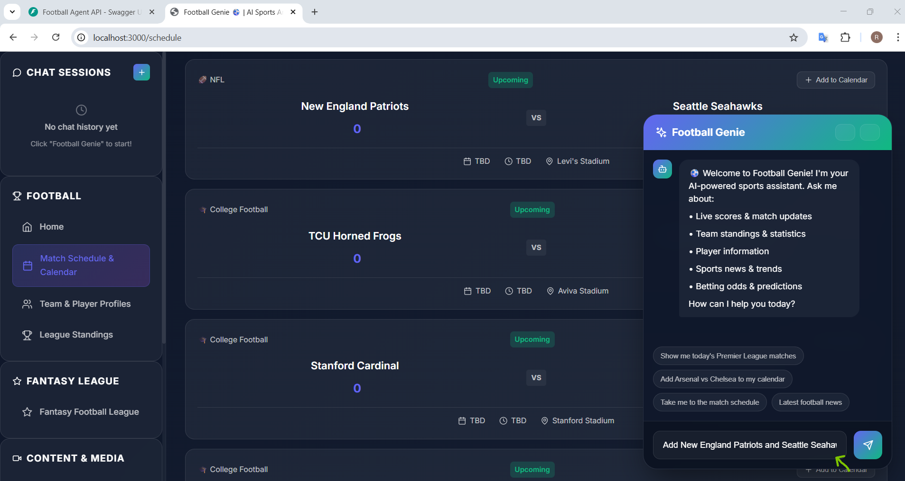
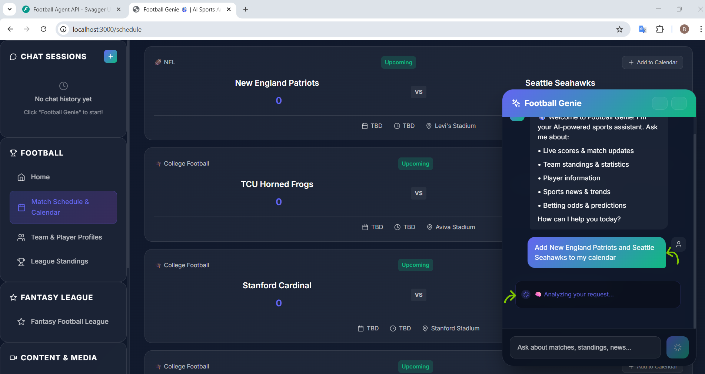
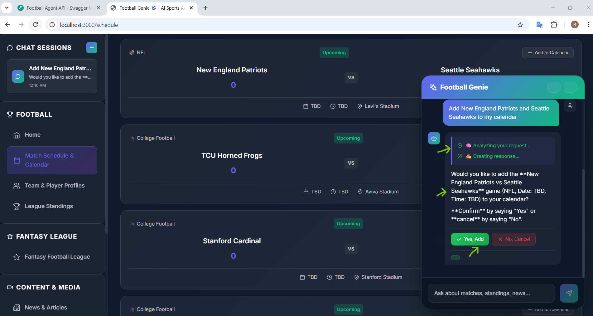
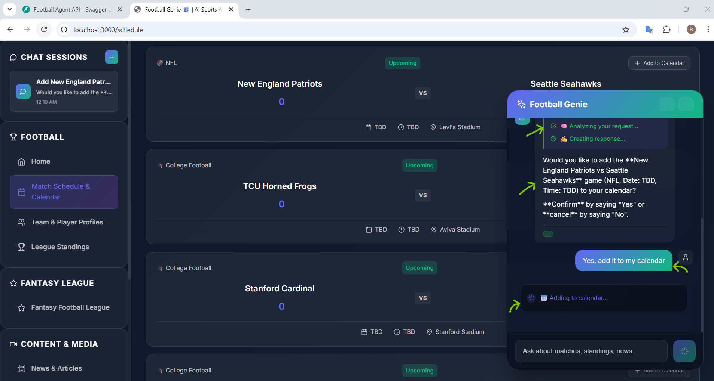
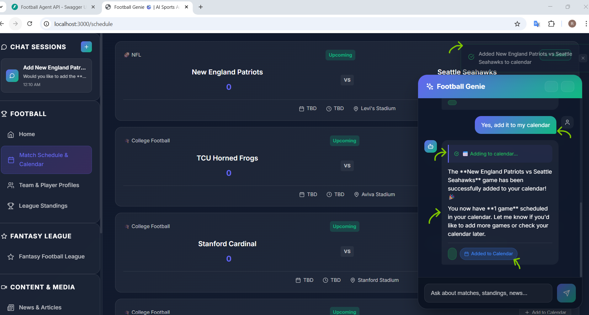
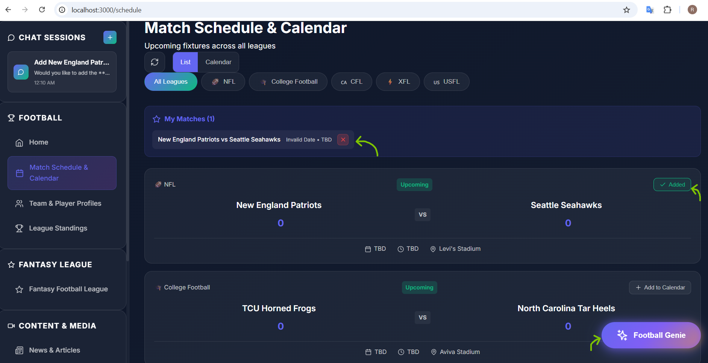

# ⚽ Football AI Agent asistant

An **agentic web application** for football with AI assistant, where user can talk to AI assistant chatbot and ask for information or to perform various tasks. The user does not have to navigate or wander around different menu options; It asks the chatbot in natural language to perform certain task, and the agent first analyses the user request. If it's just information retrieval then it responds with the retrived information and if user requests to perform certain task (Add, update, delete etc) then chatbot prompt (with task details) for user's approval before performing it. The chatbot also shows the tasks it is currently performing in the chat and and final result after completing the task with pop-up notification. After the task is completed the UI content/rendering is updated as well.

**Example queries:**
- "Show me today's Premier League matches"
- "Get the current league standings"
- "Save/add Chelsea to my favorites"
- "add Travis Kelce to my favorites"
- "Remove Josh Allen from my favorites"
- "Add NFL New England Patriots VS Seattle Seahawks to my calendar"
- "Remove Virginia Cavaliers vs NC State Wolfpack from my calendar"


The application is built as a microservices architecture with separate backend API and frontend services. The backend is developed with **LangGraph**, **LangChain**, and **ChromaDB**. LangGraph is used for building the agentic workflow. LangChain is used for tool defintion and LLM integration. ChromaDB is used as vetcor database for knowledge storage. For real-time sports (football) data open-source ESPN APIs (https://site.api.espn.com/apis/site/v2/sports/{sport}/{league}/{resource}) are used from "https://github.com/pseudo-r/Public-ESPN-API". Wrappers tools are defined around these APIs to fetch the information or to perform any task. When the use prompt for any task or information, frontend passes the request to the backend where the agent (LLM) analyses the request and call these relevant tools accordingly to perfrom the activities. After that final response is again passed to th e LLM to analyse the resaponse. The final response is then passed to the frontend, where the client renders the responds.


## 🏗️ Architecture

```
┌─────────────────────────────────────────────────────────────────┐
│                     Football Agent System                        │
├─────────────────────────────────────────────────────────────────┤
│                                                                  │
│   ┌──────────────────┐         ┌──────────────────────────┐     │
│   │     Frontend     │  HTTP   │      Backend API          │     │
│   │   (Port 3000)    │◄───────►│     (Port 8000)           │     │
│   │                  │   REST  │                           │     │
│   │  • HTML/CSS/JS   │         │  • FastAPI               │     │
│   │  • Glassmorphism │         │  • LangGraph Agent       │     │
│   │  • Responsive    │         │  • LangChain Tools       │     │
│   └──────────────────┘         │  • ChromaDB Vector Store │     │
│                                │  • Groq / OpenAI LLM     │     │
│                                └──────────────────────────┘     │
│                                           │                      │
│                                           ▼                      │
│                                ┌──────────────────┐             │
│                                │    ChromaDB      │             │
│                                │  (Vector Store)  │             │
│                                └──────────────────┘             │
└─────────────────────────────────────────────────────────────────┘
```

## ✨ Features

### 1. LangGraph Agent
- **Natural Language Understanding**: Supports Groq or OpenAI LLMs
- **Stateful Workflows**: LangGraph manages conversation state
- **Tool Execution**: 6 LangChain tools for football data
- **Semantic Search**: ChromaDB vector store for knowledge retrieval

### 2. Server-Side Tools (6 LangChain Tools)
| Tool | Description | Requires Approval |
|------|-------------|-------------------|
| `fetch_matches` | Get live/upcoming football matches with filters | No |
| `get_team_stats` | Get detailed team statistics | No |
| `get_league_standings` | Get league table with analysis | No |
| `search_players` | Search players by name, team, position | No |
| `save_favorite_team` | Save team to favorites | **Yes** ✅ |
| `search_knowledge` | Semantic search in knowledge base | No |

### 3. Client-Side Actions (4 Actions)
| Action | Description |
|--------|-------------|
| `filter_results` | Dynamic filtering and sorting of results |
| `export_data` | Download results as CSV or JSON |
| `update_chart` | Display visual charts for statistics |
| `add_to_watchlist` | Add matches to personal watchlist |

### 4. Knowledge System (ChromaDB)
- **Semantic Search**: Vector-based similarity search
- **Favorite Teams**: Save and track your favorite teams
- **Search History**: Recent queries for quick re-execution
- **Knowledge Influence**: UI shows when knowledge affected results

### 5. Modern UI Design
- **React 18.2**: Framework
- **Vite 5.1**: Build Tool

## 🚀 Quick Start/run
 
### One-Command Setup (Linux / macOS / Windows Git Bash)

```bash
# Clone the repository
git clone git@github.com:rpatel005/Football_Genie_Agent.git
cd Football_Genie_Agent

# Run the setup script
chmod +x setup.sh
./setup.sh
```
The setup script will:
- Detect your OS (Linux, macOS, Windows)
- Check for Python 3.11+ and Node.js 18+
- Create `.env` from `.env.example`
- Prompt for your LLM API key (Groq or OpenAI)
- Create Python virtual environment
- Install all dependencies
- Start backend (port 8000) and frontend (port 3000)

# Access the app
Frontend: http://localhost:3000
Backend API: http://localhost:8000/docs
Press `Ctrl+C` to stop all services.

## 🔧 Configuration

### Environment Variables

Create a `.env` file in the root directory:

```env
# LLM API Keys (set at least one - Groq is checked first)
GROQ_API_KEY=your_groq_api_key_here
OPENAI_API_KEY=your_openai_api_key_here

# Model names (optional - defaults provided)
GROQ_MODEL=qwen/qwen3-32b
OPENAI_MODEL=GPT-4o-mini

# Backend Configuration
BACKEND_PORT=8000
API_URL=http://localhost:8000/docs

# Frontend Configuration  
FRONTEND_PORT=3000
FRONTEND_URL=http://localhost:3000
```

**LLM Provider Priority:**
1. If `GROQ_API_KEY` is set → uses Groq
2. Else if `OPENAI_API_KEY` is set → uses OpenAI

## 📁 Project Structure

```
sportsradar/
├── backend/                    # Backend API Microservice
│   ├── __init__.py
│   ├── server.py              # FastAPI REST API
│   ├── langgraph_agent.py     # LangGraph agent workflow
│   ├── langchain_tools.py     # LangChain tool definitions
│   ├── vector_store.py        # ChromaDB vector store
│   ├── football_data.py       # Football data service
│   ├── models.py              # Pydantic data models
│   └── Dockerfile             # Backend container
├── frontend/                   # Frontend Microservice
│   ├── index.html             # Main HTML page
│   ├── styles.css             # Glassmorphism CSS
│   ├── app.js                 # Frontend JavaScript
│   ├── package.json           # Node.js config
│   ├── nginx.conf             # Nginx configuration
│   └── Dockerfile             # Frontend container
├── scripts/                    # PowerShell scripts
│   ├── start-backend.ps1      # Start backend
│   ├── start-frontend.ps1     # Start frontend
│   └── start-dev.ps1          # Start both services
├── tests/                      # Test suite
│   ├── test_api.py
│   └── test_football_data.py
├── chroma_db/                  # ChromaDB data directory
├── docker-compose.yml          # Docker orchestration
├── pyproject.toml              # Python dependencies
├── .env.example                # Environment template
└── README.md
```

## 🔌 API Endpoints

### Base URLs
- **Backend API**: `http://localhost:8000`
- **Frontend**: `http://localhost:3000`

### Agent Endpoints
| Method | Endpoint | Description |
|--------|----------|-------------|
| `POST` | `/api/agent/chat` | Send message to agent |
| `POST` | `/api/agent/goal` | Legacy endpoint (→ chat) |
| `POST` | `/api/agent/approve` | Approve/reject actions |
| `GET` | `/api/agent/session/{id}` | Get session state |
| `GET` | `/api/agent/info` | Agent configuration info |

### Knowledge Endpoints
| Method | Endpoint | Description |
|--------|----------|-------------|
| `GET` | `/api/knowledge` | Get knowledge items |
| `POST` | `/api/knowledge` | Add knowledge item |
| `DELETE` | `/api/knowledge/{id}` | Delete item |
| `GET` | `/api/knowledge/search` | Semantic search |
| `GET` | `/api/knowledge/favorites` | Get favorite teams |
| `GET` | `/api/knowledge/history` | Get search history |

## 🧪 Running Tests
```bash
# Run all tests
pytest
# Run with coverage
pytest --cov=backend --cov-report=html
```
## 🔧 Tech Stack

### Backend
- **Python 3.12** - Runtime
- **FastAPI** - REST API framework
- **LangGraph** - Agent workflow orchestration
- **LangChain** - Tool definitions & LLM integration
- **LangChain-Groq** - Groq LLM provider
- **LangChain-OpenAI** - OpenAI LLM provider
- **ChromaDB** - Vector database
- **Pydantic** - Data validation
- **Uvicorn** - ASGI server

### Frontend
- **HTML5/CSS3/JavaScript** - Core web technologies
- **ReactJs** - Modern UI aesthetics

## ⚖️ Tradeoffs & next steps

### Why Microservices?
- **Independent Scaling**: Scale backend and frontend separately
- **Technology Flexibility**: Swap frontend framework without touching backend
- **Development Workflow**: Teams can work independently
- **Deployment Options**: Deploy to different services/hosts

### Why LangGraph + Groq/OpenAI?
- **Groq**: fast inference for LLMs (recommended) and Free but limited tokens/uses.
- **OpenAI**: GPT-4o for high quality responses but paid.
- **LangGraph**: Stateful agent workflows with proper tool handling

### Next Steps

| Priority | Feature | Description |
|----------|---------|-------------|
| 🔴 High | **User Authentication** | Add JWT-based auth with login/signup for personalized experiences |
| 🔴 High | **WebSocket Integration** | Real-time match updates and live score notifications |
| 🟡 Medium | **Multi-League Expansion** | Support for NBA, MLB, NHL, and international leagues |
| 🟡 Medium | **Advanced Analytics** | Player performance predictions using ML models |
| 🟡 Medium | **PWA Support** | Convert to Progressive Web App for mobile installation |
| 🟢 Low | **CI/CD Pipeline** | GitHub Actions for automated testing and deployment |
| 🟢 Low | **Caching Layer** | Redis caching for API responses to improve performance |
| 🟢 Low | **Multi-language Support** | i18n for Spanish, French, German interfaces |
| 🟢 Low | **Voice Interface** | Speech-to-text for hands-free queries |

---

Built with ❤️ for Sportradar












